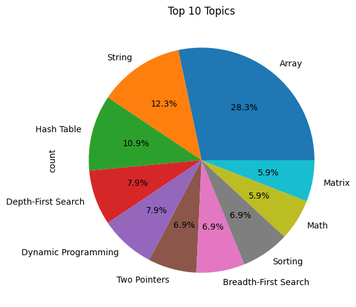
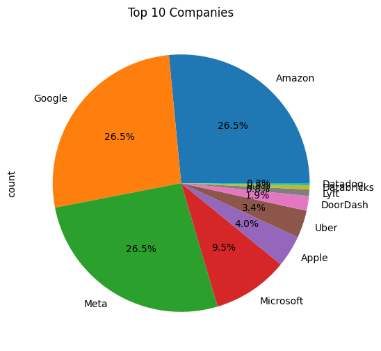
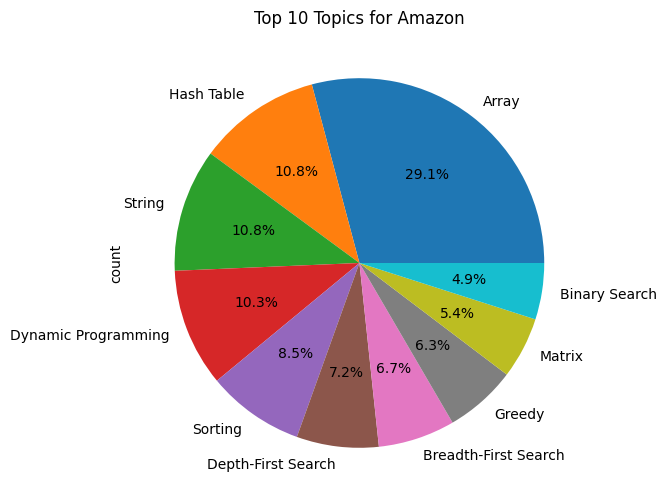
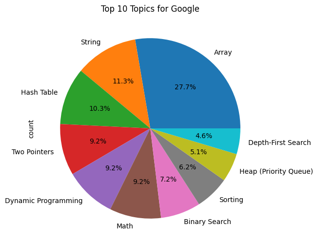
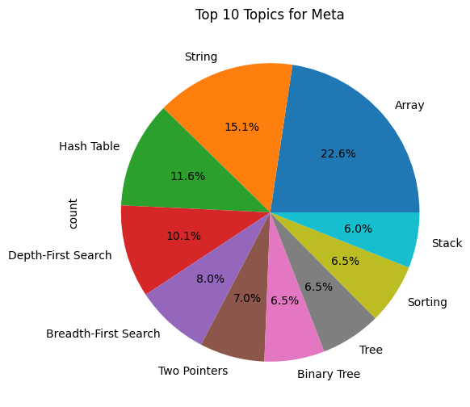

## Leetcode Company wise Problems Lists

- Curated lists of Leetcode questions group by companies, updated as of 1 June 2025.
- Each company folder consists of questions from the past 30, 60, 90 days and all time questions wherever available.

- System Design Notes: https://github.com/liquidslr/system-design-notes

- I have compiled the most [recent](./recent.csv) (past 30 days) problems by few top companies - Meta, Apple, Amazon, Google, Microsoft, Uber, Tesla, Lyft, Databricks, Block, Datadog, DoorDash

- 10 most common topics 

- Problem distribution by above-mentioned companies 

- Most common topics for Amazon 

- Most common topics for Google 

- Most common topics for Meta 